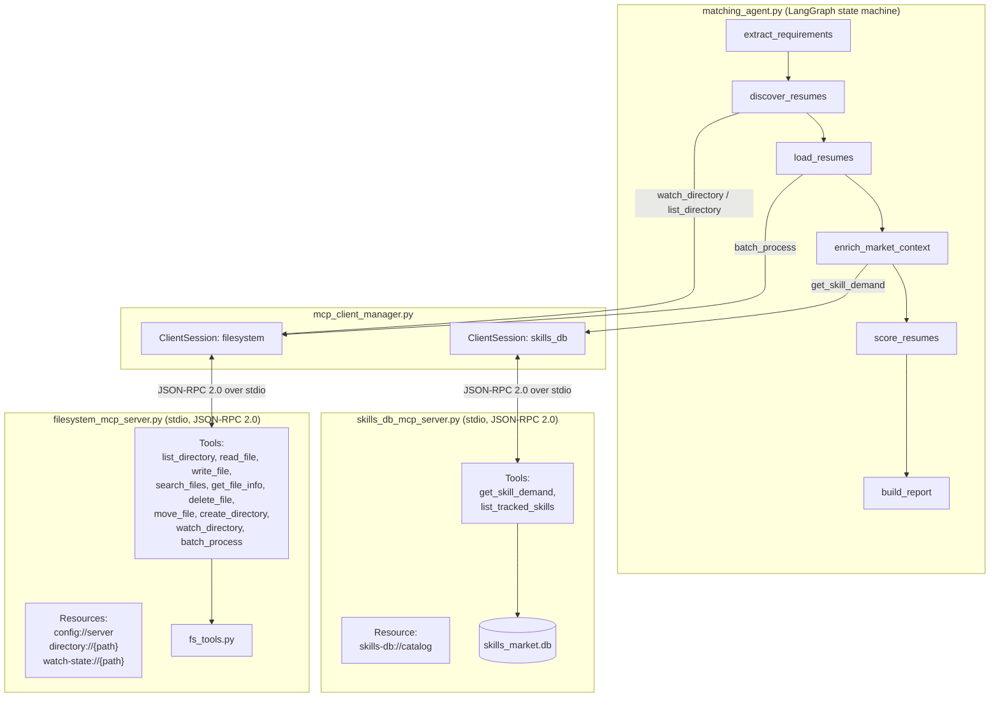
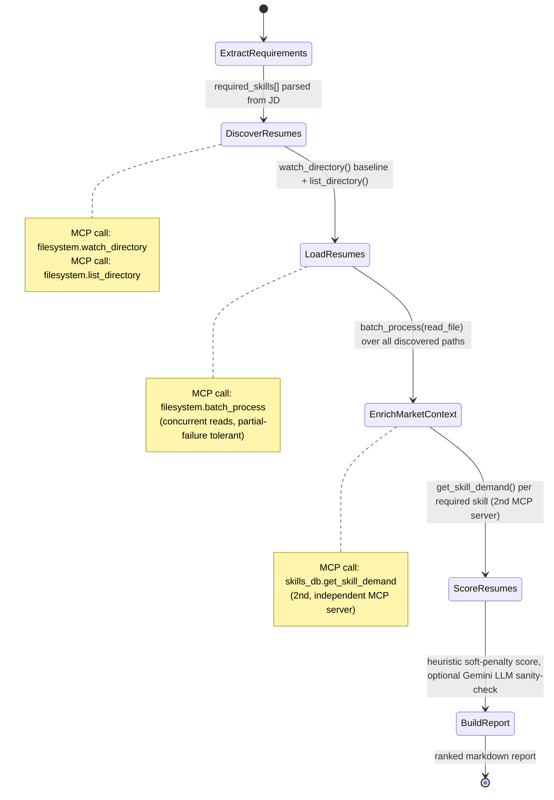
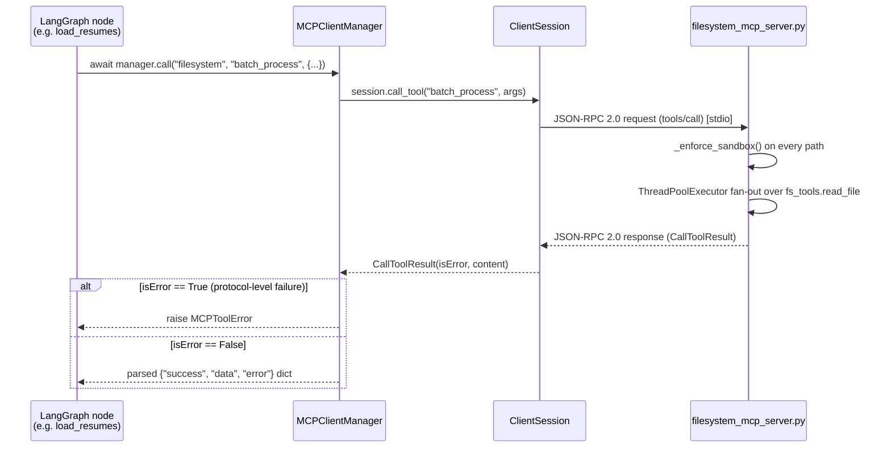

# Milestone 4 — Architecture: Agent ↔ MCP Interaction

## 1. System overview

## 2. Why two MCP servers instead of one

`filesystem_mcp_server.py` owns everything I/O-shaped: reading resumes,
watching a directory, batch operations. `skills_db_mcp_server.py` owns a
completely unrelated capability (skills market intelligence) and is a
separate process with its own tool namespace and its own resource. The
agent (`matching_agent.py`) doesn't know or care that they're implemented
differently under the hood — it just holds two `ClientSession`s through
`MCPClientManager` and calls whichever server owns the capability it needs.
This is the point of MCP: **capabilities are servers, not imports.**
Swapping `skills_db_mcp_server.py` for a real jobs-market API tomorrow
means editing one file; `matching_agent.py` doesn't change.

## 3. State machine — one agent run

## 4. Request/response lifecycle for a single tool call

## 5. Error-handling layers (why there are two)

| Layer | Example | Surfaced as |
|---|---|---|
| Protocol-level | path outside sandbox, unsupported `batch_process` operation, malformed args | `McpError` → `CallToolResult(isError=True)` → `MCPToolError` raised to the agent |
| Business-level | file not found, file already exists without `overwrite=True` | Normal tool result: `{"success": false, "error": "..."}` — the call succeeded, the *operation* didn't |

Keeping these separate means a single bad resume file (business-level)
never aborts a batch, but a client trying to read `/etc/passwd`
(protocol-level abuse) is stopped hard, with a real JSON-RPC error, not a
silently-ignored request.

## 6. Configuration management

`filesystem_mcp_server.py`'s `ServerConfig` is driven entirely by
environment variables (`MCP_FS_ROOT`, `MCP_FS_MAX_BATCH`,
`MCP_FS_BATCH_WORKERS`, `MCP_FS_WATCH_POLL`), so the exact same server
binary can be sandboxed to a CI temp dir, a demo folder, or Anjeee's real
resume drop folder without touching code. The active configuration is
itself discoverable at runtime via the `config://server` MCP resource.
